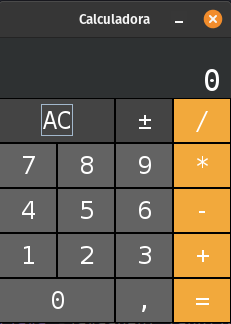

# Calculadora

Calculadora é um dispositivo para a realização de cálculos numéricos. São considerados distinto das máquinas calculadoras e dos computadores, no sentido em que a calculadora é um dispositivo voltado para fins específicos e que não pode ser qualificada como uma Máquina de Turing.
Se quiser saber mais sobre, confere esse artigo da wikipedia [aqui](https://pt.wikipedia.org/wiki/Calculadora) 

Esse projeto foi desenvolvido a fins didático com o objetivo de usar funcionalidade desenvolvida no curso. Fiz algumas alterações no projeto em relação ao apresentado.



## Como funciona a Calculadora
Calculadora tem um teclado digital.
* Basta clicar com botão esquerdo do mouse no número desejado, e irá aparecer o número escolhido no displays.
* Após click com botão esquerdo do mouse na operação desejada.
* Escolhas próximo número para fazer operação.
* Click no sinal de igual para mostrar o resultado no displays.
* Caso queira zerar a calculadora click em 'AC'.
* Caso queira trocar o sinal, click em '±'.

## Funcionamento do arquivo jar
As instruções abaixo ir ajudar a roda o arquivo jar do projeto. Para isso, siga o passo-a-passo abaixo:

1. Baixe o arquivo que estar presente no no diretório arquivo-jar-projeto.

2. Com JDK 11 instalada na sua máquina. Abra o terminal onde está o arquivo baixado no passo 1.

3. Execute o arquivo 'campo-minado.jar' no terminal. Com o comando ```java -jar Calculadora.jar```.


## Funcionamento do projeto Main
As instruções abaixo ir ajudar a roda o main do projeto. Para isso, siga o passo-a-passo abaixo:

1. Baixe o projeto.

2. Execute o arquivo 'Calculadora.java' como main na sua IDE.

## Tecnologia usada
* Java 11
* API Collection
* Lambda 
* Swing
* Estrutura Observe

## Pontos a melhorar
* Fazer a tecla de porcentagem.
* Fazer histórico da conta.

